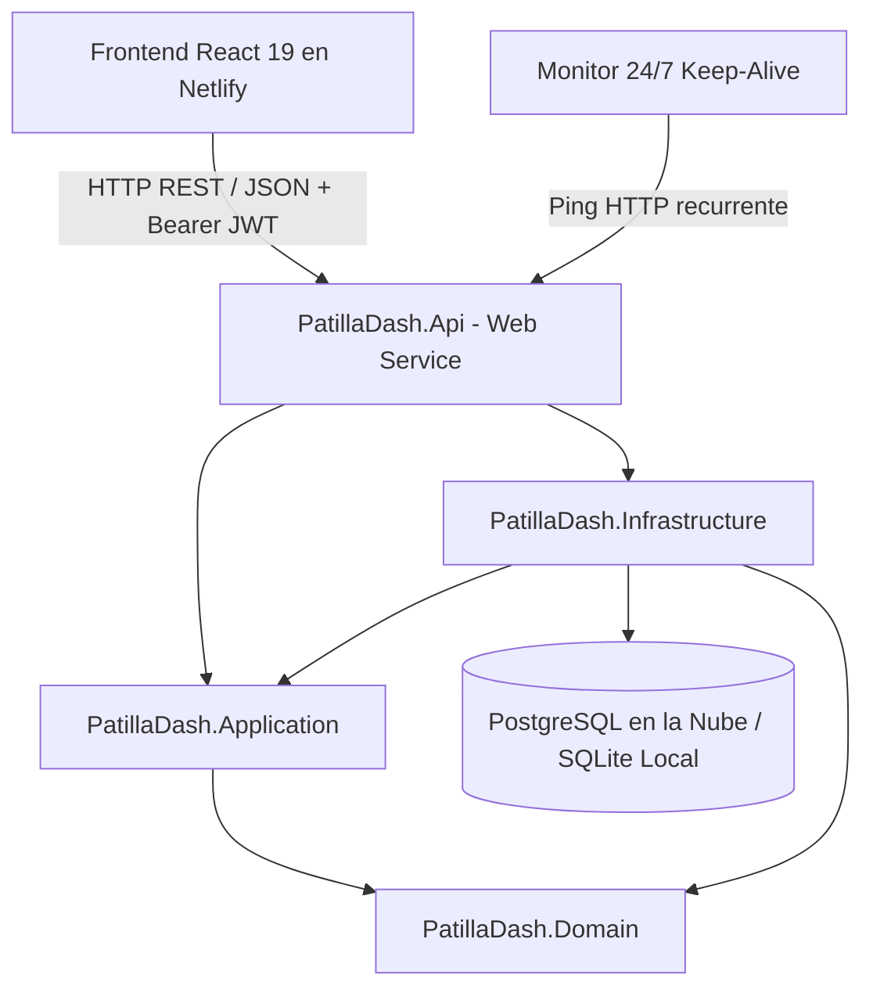

# 🍉 PatillaDash — Plataforma de Gestión Multi-Sede de Bebidas Artesanales

Bienvenido al repositorio central de **PatillaDash**, una solución web full-stack moderna, reactiva y desacoplada para la administración, ventas, abastecimiento, business intelligence e inventario de puntos de venta de bebidas artesanales de patilla (*"patillazos"*), refrescos y fritos.

> 🌐 **Aplicación Web en Producción:** [https://patilladash.netlify.app](https://patilladash.netlify.app)

---

## 📑 Tabla de Contenidos
1. [Visión y Modelo de Negocio](#-visión-y-modelo-de-negocio)
2. [Stack Tecnológico](#-stack-tecnológico)
3. [Arquitectura del Sistema](#-arquitectura-del-sistema)
4. [Roles y Acceso al Sistema](#-roles-y-acceso-al-sistema)
5. [Guía de Inicio Rápido](#-guía-de-inicio-rápido)
   - [Paso 1: Iniciar el Backend (.NET 10 API)](#paso-1-iniciar-el-backend-net-10-api)
   - [Paso 2: Iniciar el Frontend (React 19 + Vite)](#paso-2-iniciar-el-frontend-react-19--vite)
   - [Prueba en Teléfonos Móviles (Red Wi-Fi Local)](#-prueba-en-teléfonos-móviles-red-wi-fi-local)
6. [Módulos y Experiencia de Usuario (UX/UI)](#-módulos-y-experiencia-de-usuario-uxui)
   - [Panel del Vendedor (Wizard Móvil en 3 Pasos)](#1-panel-del-vendedor-wizard-móvil-en-3-pasos)
   - [Panel del Administrador](#2-panel-del-administrador)
   - [Módulo de Business Intelligence (BI) y Analítica](#3-módulo-de-business-intelligence-bi-y-analítica)
   - [Flujo Directo de Reabastecimiento Crítico](#4-flujo-directo-de-reabastecimiento-crítico)
   - [Experiencia Móvil Optimizada, Safari iOS y Resiliencia](#5-experiencia-móvil-optimizada-safari-ios-y-resiliencia)
7. [Seguridad y Anti-Inyecciones SQL](#-seguridad-y-anti-inyecciones-sql)
8. [Infraestructura y Despliegue en la Nube](#-infraestructura-y-despliegue-en-la-nube)
   - [Backend en Render](#backend-en-render-web-service)
   - [Frontend en Netlify](#frontend-en-netlify-spa)
   - [Base de Datos PostgreSQL (Supabase)](#base-de-datos-postgresql-supabase)
   - [Estrategia Keep-Alive 24/7 (Anti Cold-Start Gratuita)](#estrategia-keep-alive-247-anti-cold-start-gratuita)
   - [Portabilidad y Migración Futura de Base de Datos](#portabilidad-y-migración-futura-de-base-de-datos)
9. [Arquitectura de Servicios y Módulos de la API](#-arquitectura-de-servicios-y-módulos-de-la-api)
10. [Documentación Interactiva Local (Scalar OpenAPI)](#-documentación-interactiva-local-scalar-openapi)
11. [Pruebas Automatizadas (Testing)](#-pruebas-automatizadas)
12. [Estructura del Repositorio](#-estructura-del-repositorio)
13. [Creadores y Créditos](#-creadores-y-créditos)

---

## 🍉 Visión y Modelo de Negocio

El negocio de bebidas artesanales opera bajo el principio de **"Registro de Operación Diaria por Declaración"**:
* **Naturaleza de la materia prima:** Debido a la variabilidad natural del tamaño y rendimiento de las frutas, el inventario **no** se descuenta con recetas teóricas automáticas por vaso servido.
* **Cierre de Turno del Vendedor:** Al finalizar la jornada, el colaborador declara los totales recibidos en caja (**Efectivo** vs. **Transferencias / Nequi / Daviplata**), los productos vendidos y la **cantidad exacta de insumos consumidos** (ej. kilos de fruta, vasos, bolsas de insumos). Al enviar el formulario, el backend descuenta en tiempo real los insumos del stock de la sede.
* **Consolidación del Administrador:** El Administrador supervisa el inventario de todas las sedes con alertas de stock crítico separadas por local, ingresa compras de materia prima (que suman inventario automáticamente), gestiona el equipo de trabajo y nómina con asignación estricta de sede, audita cierres comparando dinero reportado vs. productos vendidos y consulta métricas avanzadas de Business Intelligence.

### Matriz de Roles y Permisos

| Rol | Alcance | Vistas y Permisos Habilitados |
| :--- | :--- | :--- |
| **Vendedor** | Solo su local asignado (`LocalId`) | • **Formulario Asistido (Wizard 3 Pasos):** Efectivo, Transferencias, Productos Vendidos e Insumos consumidos del catálogo de la sede.<br>• **Mi Historial de Turnos:** Pestaña independiente paginada a 10 registros por página con formateo seguro de fechas.<br>• **Toasts Flotantes:** Notificaciones fijas en la parte superior sin necesidad de scroll.<br>• **Mobile Friendly:** Prevención de auto-zoom en iOS Safari, teclado adaptativo y persistencia de sesión por 30 días. |
| **Administrador** | Global (Todas las sedes) | • **Dashboard & BI:** Balance Neto, Ingresos, Gastos (Compras + Nómina), Alertas de Stock Crítico por Sede y **Modal Interactivo de Business Intelligence (BI)**.<br>• **Ventas y Cierres:** Historial general paginado (10 items) con **Auditoría de Cuadre** (Caja vs. Productos vendidos) y fechas sin excepciones en WebKit.<br>• **Gestión de Productos:** Catálogo dinámico con activación/desactivación de ítems en 1 clic y modal accesible.<br>• **Inventario:** Stock en tiempo real, alertas de mínimo y ajuste manual.<br>• **Compras y Reabastecimiento:** Panel prioritario de insumos críticos con compras a 1-clic y suma automática a inventario.<br>• **Personal y Nómina:** Doble pestaña (**Colaboradores** con tarjetas de equipo, badge blindado contra desbordamiento y registro de pagos directos + **Historial de Nómina** con totales y filtros) + Modal de **Registro de Nuevos Colaboradores**. |

---

## 🛠️ Stack Tecnológico

### Backend
* **Runtime:** .NET 10.0 (C# 13)
* **Framework:** ASP.NET Core Web API
* **Arquitectura:** Clean Architecture (Domain-Driven Design)
* **ORM:** Entity Framework Core 10 (Soporte multi-proveedor SQLite para desarrollo local y PostgreSQL para producción en la nube)
* **Seguridad:** JWT Bearer Authentication con vigencia de 30 días y `ClockSkew` tolerante de 5 minutos + Hasheo criptográfico de contraseñas con `BCrypt.Net-Next` + Consultas 100% parametrizadas anti-inyección SQL + Rate Limiting en autenticación
* **Validación:** FluentValidation + Filtro global de validación
* **Manejo de Errores:** RFC 7807 `ProblemDetails` / `ValidationProblemDetails`
* **Documentación:** OpenAPI con `Scalar API Reference`
* **Testing:** xUnit, Moq, FluentAssertions (22 pruebas unitarias y de integración)

### Frontend
* **Entorno & Build Tool:** Node.js + Vite 8
* **Librería UI:** React 19 SPA
* **Enrutamiento:** React Router DOM v7 con `ProtectedRoute`, sincronización inmediata de sesión y Guards por Rol
* **Estilos:** Tailwind CSS v4 con paleta temática personalizada (`patilla-*`)
* **Iconografía:** Lucide React
* **Cliente HTTP:** Axios con interceptores para inyección de JWT, lectura blindada de `localStorage` y captura de 401
* **UX Móvil & Resiliencia:** `ErrorBoundary` global no destructivo, formateador seguro de fechas para WebKit (`fechas.js`), prevención de auto-zoom en inputs de iOS (16px base), `overscroll-contain`, aceleración por GPU (`transform-gpu`) y congelamiento completo del scroll de fondo (`body` y `documentElement`) en modales.

---

## 🏛️ Arquitectura del Sistema



---

## 🔑 Roles y Acceso al Sistema

La plataforma implementa un modelo de autorización por roles (RBAC) con separación estricta de alcance operativo y administrativo:

| Rol | Tipo de Usuario | Alcance y Responsabilidad | Acceso |
| :--- | :--- | :--- | :--- |
| **Administrador** | Gestión de Negocio / Finanzas | Supervisión global interactiva de todas las sedes, compras, nómina, catálogo de productos y Business Intelligence. | Credenciales maestras configuradas en despliegue |
| **Vendedor** | Personal en Punto de Venta | Operación restringida a la sede asignada: registro de turnos diarios (dinero en caja, productos servidos e insumos consumidos). | Cuentas creadas internamente por el Administrador |

> 🔒 **Buenas Prácticas de Seguridad en Repositorios Públicos:**  
> Por directrices de ciberseguridad y privacidad, **ninguna contraseña, credencial de acceso ni dato privado de colaboradores se publica en este repositorio**. Los accesos al sistema son administrados mediante hashes criptográficos **BCrypt** y tokens Bearer JWT firmados con llaves de entorno privadas.

### Catálogo de Productos y Precios Dinámicos
Los productos, categorías y listas de precios se gestionan de forma 100% dinâmica e independiente desde el panel web de Administración (`/admin/productos`), permitiendo crear nuevos ítems, actualizar tarifas al instante y habilitar o deshabilitar productos según la disponibilidad de inventario sin necesidad de alterar código fuente.

---

## 🚀 Guía de Inicio Rápido

### Requisitos Previos
* [.NET 10 SDK](https://dotnet.microsoft.com/download) instalado (`dotnet --version`).
* [Node.js](https://nodejs.org/) v20+ y `npm` instalados (`node -v`, `npm -v`).

---

### Paso 1: Iniciar el Backend (.NET 10 API)

Abre una terminal y ejecuta:

```bash
cd src/Backend/PatillaDash.Api
dotnet run
```

> **La API se ejecutará en:** `http://localhost:5136` (y `http://0.0.0.0:5136` para red local)  
> **Documentación interactiva de desarrollo (Scalar):** [`http://localhost:5136/scalar/v1`](http://localhost:5136/scalar/v1)

---

### Paso 2: Iniciar el Frontend (React 19 + Vite)

Abre una **segunda terminal** y ejecuta:

```bash
cd src/Frontend
npm install
npm run dev
```

> **La aplicación cliente estará lista en:** [`http://localhost:5173`](http://localhost:5173)

---

### 📱 Prueba en Teléfonos Móviles (Red Wi-Fi Local)

Para probar la plataforma desde diferentes smartphones conectados a la misma red Wi-Fi:
1. Obtén tu IP local (`ip addr show` o `ifconfig`).
2. Abre el navegador en el teléfono e ingresa a:
   ```text
   http://<TU_IP_LOCAL>:5173
   ```
   *(Ejemplo: `http://192.168.1.15:5173`)*

---

## 🖥️ Módulos y Experiencia de Usuario (UX/UI)

### 1. Panel del Vendedor (Wizard Móvil en 3 Pasos)
Diseñado específicamente para smartphones y agilidad en el puesto de trabajo:
* **Paso 1 (Dinero en Caja):** Ingreso de Efectivo físico y Transferencias (Nequi / Daviplata) con totalizador en vivo.
* **Paso 2 (Productos Vendidos):** Catálogo interactivo de productos con botones táctiles de incremento/decremento `+` / `-`.
* **Paso 3 (Insumos Gastados & Finalizar):** Formulario dinámico con todos los insumos de la sede (Materia prima, vasos, endulzantes, complementos) y novedades del turno.
* **Pestaña "Mi Historial":** Vista separada con paginación de 10 turnos por página y formato de fechas unificado y seguro (`es-CO`).

---

### 2. Panel del Administrador
* **Dashboard (`/admin`):**
  * Balance Neto, Ingresos Totales, Gastos (Compras + Nómina) y Métodos de Pago.
  * **Alertas de Stock Crítico agrupadas por Sede:** Visualiza rápidamente qué insumos faltan en cada local con botón directo `Surtir este insumo`.
  * Ranking consolidado de ventas por local.
* **Ventas y Cierres (`/admin/ventas`):**
  * Historial general con filtro por sede y paginación de 10 registros.
  * **Auditoría de Cierre:** Comparativa automática entre el *Dinero Reportado en Caja* vs. *Total según Productos Vendidos* indicando **Cuadre Perfecto ($0)**, **Sobrante** o **Descuadre**.
* **Gestión de Productos (`/admin/productos`):**
  * Creación, edición de precios y activación/desactivación dinámica de ítems con modal responsivo y congelación de fondo.
* **Inventario General (`/admin/inventario`):**
  * Existencias en tiempo real, alertas de stock mínimo y ajuste directo de existencias.
* **Compras y Entradas (`/admin/compras`):**
  * Panel superior de reabastecimiento urgente de insumos en alerta y registro con auto-incremento de stock.
* **Personal y Nómina (`/admin/pagos`):**
  * **Pestaña Colaboradores:** Tarjetas visuales de cada trabajador del equipo con avatar de iniciales, rol con badge blindado contra desbordamiento (`ADMINISTRADOR` / `VENDEDOR`), sede asignada (*Local #1* / *Local #2*), correo del sistema y nómina total acumulada.
  * **Registrar Pago Rápido:** Cada tarjeta contiene un botón directo para registrar pago al colaborador en un solo clic.
  * **Nuevo Colaborador:** Modal para registrar personal en la plataforma indicando nombre, correo, contraseña inicial, rol y sede de trabajo (acceso exclusivo para administradores).
  * **Pestaña Historial de Nómina:** Total general pagado, filtro de sede compartido y tabla responsiva paginada a 10 recibos.

---

### 3. Módulo de Business Intelligence (BI) y Analítica
Al hacer clic en la tarjeta **Ingresos Totales (BI)** del Dashboard:
* **Filtros Dinámicos:** Segmentación por Sede (*Todas*, *Local #1*, *Local #2*) y Periodo (*Histórico*, *Últimos 30 días*, *Últimos 7 días*).
* **Métricas Clave:** Ingresos filtrados, Ticket Promedio por Turno, Total de Unidades Vendidas y Turnos Auditados.
* **Gráficas Integradas:** Participación de ventas por sede, productos más vendidos y distribución de medios de pago (Efectivo vs. Transferencia).

---

### 4. Flujo Directo de Reabastecimiento Crítico
* Desde las alertas de stock crítico en el Dashboard, cada insumo incluye el acceso directo `Surtir este insumo`.
* Al hacer clic, navega automáticamente a la vista de compras (`/admin/compras`), pre-seleccionando la sede, el insumo correspondiente y abriendo el modal de registro al instante.

---

### 5. Experiencia Móvil Optimizada, Safari iOS y Resiliencia

* **Normalizador de Fechas para WebKit / iOS Safari (`fechas.js`):** Safari en iPhone descarta cadenas ISO con más de 3 dígitos de subsegundo de .NET (`.1234567Z`), arrojando una excepción crítica `RangeError: date value is not finite`. El módulo [`src/Frontend/src/utils/fechas.js`](file:///home/edgardopacheco/EDGARDO%20PACHECO/RiderProjects/PatillaDash/src/Frontend/src/utils/fechas.js) trunca a milisegundos estándar (`.123Z`), valida la finitud de la fecha y garantiza un renderizado 100% a prueba de fallos.
* **Sesión Persistente de 30 Días:** Para evitar que las vendedoras deban reingresar credenciales tras dejar el teléfono en reposo o al día siguiente, los tokens JWT expiran a los **30 días** y cuentan con **5 minutos de `ClockSkew`** para tolerar fluctuaciones de sincronización entre el reloj del dispositivo móvil y el servidor.
* **Error Boundary No Destructivo:** Si ocurre algún error visual inesperado en la interfaz, el capturador de errores muestra una pantalla amigable y su botón «Recargar Pantalla» usa `window.location.reload()`, **preservando intacta la sesión** del usuario en lugar de expulsarlo al formulario de inicio de sesión.
* **Bloqueo Completo de Scroll de Fondo (*Full Viewport & Body Scroll Lock*):**
  Al desplegar cualquier ventana flotante o modal (Auditoría de Ventas, Registrar Compra, Nuevo Colaborador, Registrar Pago, Catálogo de Productos, Business Intelligence o Cajón de Navegación Lateral), la aplicación congela simultáneamente `document.body` y `document.documentElement` con `overflow: hidden`.
* **Interacción Táctil y Cierre Amigable en Móviles:**
  Todos los modales cuentan con:
  - Scroll interno independiente con contención táctil (`overscroll-contain touch-pan-y flex-1`).
  - Cierre táctil por toque fuera de la ventana (*backdrop tap-to-dismiss*).
  - Altura máxima adaptativa (`max-h-[92vh]`) para no interferir con las barras de navegación de iOS Safari / Chrome Android.
* **Prevención de Auto-Zoom en iOS:** Tamaños de fuente mínimos de `16px` (`text-base sm:text-sm`) en campos de entrada para evitar que Safari amplíe bruscamente el viewport al pulsar controles de texto.
* **Autocorrección Desactivada en Credenciales:** `autoCapitalize="none"`, `autoCorrect="off"` y `spellCheck="false"` en correo electrónico para evitar que teclados móviles agreguen mayúsculas automáticas.

---

## 🔒 Seguridad y Anti-Inyecciones SQL

* **Cero SQL Concatenado:** Todas las operaciones a la base de datos se ejecutan mediante consultas fuertemente tipadas y parametrizadas con **Entity Framework Core LINQ**, eliminando cualquier vector de SQL Injection.
* **Contraseñas Criptográficamente Seguras:** Hasheadas con algoritmo **BCrypt** de factor de costo adaptativo.
* **Protección de Rutas y Tokens Criptográficos:** Validación de firmas Bearer JWT en backend con clave privada de entorno y Guards reactivos en frontend.
* **Rate Limiting Anti-Fuerza Bruta:** Control de tasa en autenticación con bloqueo automático temporal en caso de reintentos continuos.
* **CORS Restrictivo:** Admite exclusivamente orígenes legítimos verificados.

---

## ☁️ Infraestructura y Despliegue en la Nube

Toda la infraestructura productiva opera bajo un esquema de micro-servicios desacoplados y eficientes:

| Componente | Plataforma Elegida | Rol en el Sistema |
| :--- | :--- | :--- |
| **Backend API** | [Render](https://render.com) | Web Service Linux con arquitectura .NET 10 y Rate Limiting |
| **Frontend SPA** | [Netlify](https://netlify.com) | Red Global Edge CDN con CI/CD automatizado desde GitHub |
| **Base de Datos** | [Supabase](https://supabase.com) | Motor relacional PostgreSQL con aislamiento seguro |
| **Monitor Keep-Alive** | [cron-job.org](https://cron-job.org) | Monitor continuo de disponibilidad |

### Backend en Render (Web Service)
* **Entorno:** .NET 10 Web Service en Linux.
* **Variables de Entorno en Render:**
  * `DATABASE_URL`: Cadena de conexión protegida a PostgreSQL.
  * `JWT_SECRET_KEY`: Llave privada para generación y verificación de tokens JWT.
  * `PORT`: Determinado dinámicamente por la plataforma.

### Frontend en Netlify (SPA)
* **Repositorio:** Conectado a GitHub vía CI/CD (despliegues automáticos con cada `git push`).
* **Base directory:** `src/Frontend`
* **Build command:** `npm run build`
* **Publish directory:** `dist`
* **Variables de Entorno en Netlify:**
  * `VITE_API_URL`: Variable de entorno apuntando al endpoint de la API.

### Base de Datos PostgreSQL (Supabase)
* Configurada con auto-incrementos nativos vía `GENERATED BY DEFAULT AS IDENTITY`, compatibilidad de tipos `boolean`, timestamps universales y persistencia continua respaldada.

### Estrategia Keep-Alive 24/7 (Anti Cold-Start Gratuita)
En entornos de nube, las instancias pueden entrar en suspensión tras periodos prolongados de inactividad:
* Se configuró un cronjob en **cron-job.org** que envía un chequeo periódico al endpoint de salud (`/health`).
* El endpoint responde en 1 milisegundo directamente desde memoria (`{ "status": "Healthy" }`), manteniendo el contenedor activo y disponible de forma permanente para las vendedoras en los puntos de venta.

### Portabilidad y Migración Futura de Base de Datos
El proyecto fue construido bajo Clean Architecture con **cero dependencia propietaria de Supabase**:
* **100% Estándar PostgreSQL:** No se usan extensiones exclusivas ni bloqueos de tecnología propietaria.
* Si en el futuro se desea mudar a **Neon**, **Railway**, **Amazon Aurora / RDS** o un servidor propio:
  1. Exportar datos actuales con `pg_dump`.
  2. Importar en el nuevo destino con `psql`.
  3. Actualizar la variable de entorno `DATABASE_URL` en el backend.
  4. **Cero cambios de código fuente requeridos.**

---

## 📡 Arquitectura de Servicios y Módulos de la API

La API REST desacoplada distribuye sus responsabilidades comerciales en controladores especializados, donde todas las conexiones fuera de la autenticación inicial exigen token criptográfico `Bearer <JWT>` con validación estricta de rol (`Administrador` o `Vendedor`):

* 🔐 **Módulo de Identidad y Acceso:** Autenticación con limitador de tasa contra fuerza bruta, emisión de tokens con claims de sede y gestión interna de colaboradores (restringido a administradores).
* 🛒 **Módulo de Ventas y Cierres Operativos:** Recepción del reporte diario por declaración de turnos (efectivo, transferencias, productos vendidos e insumos consumidos con auto-descuento en tiempo real) y auditoría comparativa de caja.
* 📦 **Módulo de Inventario y Stock:** Consulta y cálculo de alertas de stock crítico por sede comercial y ajuste seguro de existencias.
* 🏷️ **Módulo de Catálogo de Productos:** Consulta de menú para puntos de venta y administración dinámica de productos, estados activo/inactivo y tarifas.
* 🚚 **Módulo de Compras y Reabastecimiento:** Registro de compras de materia prima e insumos con reabastecimiento directo al inventario de la sede de destino.
* 💼 **Módulo de Nómina y Personal:** Control de pagos de colaboradores, segregación por sede, historial de liquidaciones y balance de nómina.
* 📊 **Módulo de Métricas y Analítica Administrativa:** Métricas ejecutivas consolidadas y agregaciones analíticas para el panel de Business Intelligence.

---

## 📖 Documentación Interactiva Local (Scalar OpenAPI)

En fase de desarrollo local, la solución expone la especificación OpenAPI interactiva gestionada con **Scalar API Reference**:

1. Inicia la API localmente (`dotnet run`).
2. Ingresa en tu navegador a: **[`http://localhost:5136/scalar/v1`](http://localhost:5136/scalar/v1)**.

---

## 🧪 Pruebas Automatizadas

El backend cuenta con una suite de **22 pruebas unitarias y de integración** (xUnit + Moq + FluentAssertions):

```bash
# Ejecutar todas las pruebas del Backend
dotnet test --no-restore
```

Para comprobar la compilación de producción del Frontend:
```bash
cd src/Frontend
npm run build
```

---

## 📁 Estructura del Repositorio

```text
PatillaDash/
├── README.md                                 # Documentación central del proyecto
├── PATILLADASH_SPEC.md                       # Especificación técnica del negocio
├── netlify.toml                              # Configuración central de despliegue Netlify
├── PatillaDash.slnx                          # Solución .NET 10
│
├── src/
│   ├── Backend/
│   │   ├── PatillaDash.Domain/               # Entidades, Enums e Interfaces
│   │   ├── PatillaDash.Application/          # Casos de uso, DTOs y FluentValidation
│   │   ├── PatillaDash.Infrastructure/       # EF Core (SQLite / Postgres), DbInitializer, Auth
│   │   └── PatillaDash.Api/                  # Controllers REST, Scalar, Middlewares
│   │
│   └── Frontend/                             # React 19 + Vite 8 + Tailwind CSS v4 SPA
│       ├── index.html
│       ├── vite.config.js
│       ├── package.json
│       └── src/
│           ├── components/                   # AdminLayout, ProtectedRoute, ErrorBoundary, etc.
│           ├── context/                      # AuthContext
│           ├── pages/                        # Login, VendedorDashboard, AdminDashboard,
│           │                                 # AdminVentas, AdminInventario, AdminCompras,
│           │                                 # AdminPagos, AdminProductos
│           ├── services/                     # api.js con Axios y manejo seguro de errores
│           └── utils/                        # fechas.js (normalizador y formateador seguro para iOS Safari)
│
└── tests/
    └── Backend/
        └── PatillaDash.Tests/                # Tests xUnit (Domain, Application, Infra, Api)
```


---

## 👥 Creadores y Créditos

Este proyecto fue diseñado y desarrollado por:

* **Edgardo Pacheco** — [@pachecoedgardo2006-coder](https://github.com/pachecoedgardo2006-coder)
* **Mauricio Onofre** — [@onomauri](https://github.com/onomauri)
