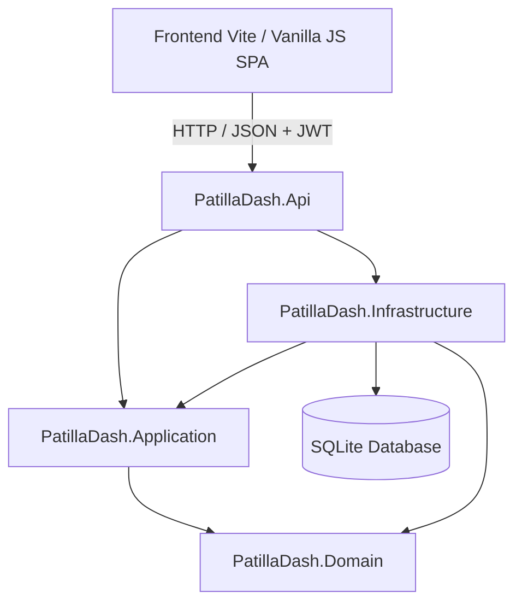

# 🍉 PatillaDash — Plataforma de Gestión Multi-Local de Bebidas Artesanales

Bienvenido al repositorio central de **PatillaDash**, una solución web moderna diseñada para la administración y operación de puntos de venta de bebidas artesanales de patilla (*"patillazos"*), jugos naturales y refrescos.

---

## 📑 Tabla de Contenidos
1. [Visión y Modelo de Negocio](#-visión-y-modelo-de-negocio)
2. [Arquitectura del Sistema](#-arquitectura-del-sistema)
3. [Stack Tecnológico](#-stack-tecnológico)
4. [Guía de Inicio Rápido (Backend)](#-guía-de-inicio-rápido-backend)
5. [Guía de Integración para Frontend](#-guía-de-integración-para-frontend)
   - [Configuración de Conexión y CORS](#configuración-de-conexión-y-cors)
   - [Autenticación JWT y Manejo de Sesión](#autenticación-jwt-y-manejo-de-sesión)
   - [Manejo de Errores Estandarizado (RFC 7807)](#manejo-de-errores-estandarizado-rfc-7807)
   - [Ejemplo de Cliente Axios](#ejemplo-de-cliente-axios)
6. [Contratos de API y Endpoints (Referencia Completa)](#-contratos-de-api-y-endpoints)
   - [Módulo de Autenticación (`/api/auth`)](#1-módulo-de-autenticación-apiauth)
   - [Módulo de Ventas Diarias (`/api/ventas`)](#2-módulo-de-ventas-diarias-apiventas)
   - [Módulo de Inventario (`/api/inventario`)](#3-módulo-de-inventario-apiinventario)
   - [Módulo de Compras (`/api/compras`)](#4-módulo-de-compras-apicompras)
   - [Módulo de Pagos y Nómina (`/api/pagos`)](#5-módulo-de-pagos-y-nómina-apipagos)
   - [Módulo de Estadísticas y Dashboard (`/api/estadisticas`)](#6-módulo-de-estadísticas-y-dashboard-apiestadisticas)
7. [Documentación Interactiva (Scalar OpenAPI)](#-documentación-interactiva-scalar-openapi)
8. [Ejecución de Pruebas Automatizadas](#-ejecución-de-pruebas-automatizadas)
9. [Estructura del Proyecto](#-estructura-del-proyecto)

---

## 🍉 Visión y Modelo de Negocio

El negocio de bebidas de patilla artesanal opera bajo el principio de **"Registro de Operación Diaria por Declaración"**:
* Debido a la variabilidad natural del tamaño y rendimiento de las frutas, el inventario **no** se descuenta con recetas teóricas automáticas por vaso vendido.
* **Cierre de Turno del Vendedor:** Al finalizar la jornada, el vendedor declara las ventas reales desglosadas por medio de pago (**Efectivo** vs. **Transferencias / Nequi / Daviplata**) y la **cantidad exacta de insumos consumidos** (ej. 3 patillas, 40 vasos, 2 kg de azúcar).
* **Consolidación del Administrador:** El Administrador supervisa el inventario de todos los locales con alertas de stock crítico, ingresa compras de insumos (que aumentan el inventario automáticamente), gestiona pagos a colaboradores y visualiza los balances financieros consolidados.

### Matriz de Roles y Permisos

| Rol | Alcance | Módulos Habilitados |
| :--- | :--- | :--- |
| **Vendedor** | Solo su local asignado (`LocalId`) | • Formulario de Cierre Diario (Ventas por categoría + Insumos gastados + Novedades).<br>• Consulta de stock de su propio local. |
| **Administrador** | Global (Todos los locales) | • Monitoreo multilocal de stock con alertas mínimas.<br>• Gestión de pagos y anticipos a personal.<br>• Entrada de facturas/compras con recarga automática de stock.<br>• Dashboard financiero (Ingresos, Gastos, Margen Neto, Ratios). |

---

## 🏛 Arquitectura del Sistema

El backend está construido bajo los principios de **Clean Architecture (Onion Architecture)** y **Domain-Driven Design (DDD)** para garantizar total desacoplamiento de la infraestructura:



* **`PatillaDash.Domain`:** Entidades ricas, reglas de invariantes, validaciones de dominio, enums e interfaces de repositorios. *Sin dependencias externas.*
* **`PatillaDash.Application`:** Casos de uso, servicios de aplicación, DTOs de entrada/salida y validadores con `FluentValidation`.
* **`PatillaDash.Infrastructure`:** Persistencia con `EF Core 10 SQLite`, configuración Fluent API, implementaciones de repositorios, `BCrypt` Hasher y generador de tokens JWT.
* **`PatillaDash.Api`:** Controladores RESTful delgados, filtros globales de validación, middlewares RFC 7807 (`ProblemDetails`), configuración de CORS y documentación interactiva Scalar.

---

## 🛠 Stack Tecnológico

### Backend
* **Runtime:** .NET 10 (C# 13)
* **Framework:** ASP.NET Core Web API
* **ORM:** Entity Framework Core 10 (SQLite)
* **Autenticación:** JWT Bearer + BCrypt.Net-Next
* **Validación:** FluentValidation + Filtro global
* **Documentación:** OpenAPI + Scalar API Reference
* **Testing:** xUnit, Moq, FluentAssertions

### Frontend (Stack Recomendado para la Fase SPA)
* **Entorno:** Node.js + Vite.js
* **Lenguaje:** JavaScript ES6+ Modules (SPA sin frameworks pesados)
* **Estilos:** Tailwind CSS v3/v4 + PostCSS
* **Cliente HTTP:** Axios con interceptores Bearer Token

---

## 🚀 Guía de Inicio Rápido (Backend)

### Requisitos Previos
* [.NET 10 SDK](https://dotnet.microsoft.com/download) instalado.

### 1. Clonar el Repositorio
```bash
git clone https://github.com/tu-usuario/PatillaDash.git
cd PatillaDash
```

### 2. Restaurar Dependencias y Compilar
```bash
dotnet restore
dotnet build
```

### 3. Aplicar Migraciones de Base de Datos
La base de datos SQLite `patilladash.db` se crea automáticamente con la migración inicial:
```bash
dotnet ef database update --project src/Backend/PatillaDash.Infrastructure/PatillaDash.Infrastructure.csproj --startup-project src/Backend/PatillaDash.Api/PatillaDash.Api.csproj
```

### 4. Ejecutar el Servidor API
```bash
dotnet run --project src/Backend/PatillaDash.Api/PatillaDash.Api.csproj
```
El servidor quedará disponible en:
* **HTTP:** `http://localhost:5136`
* **HTTPS:** `https://localhost:7057`
* **Scalar API Docs:** [`http://localhost:5136/scalar/v1`](http://localhost:5136/scalar/v1)

---

## 🌐 Guía de Integración para Frontend

Esta sección detalla cómo debe comunicarse la aplicación cliente (Vite SPA) con la API de PatillaDash.

### Configuración de Conexión y CORS
La API ya tiene configurada una política CORS permisiva para el entorno de desarrollo frontend en los puertos estándar de Vite:
* `http://localhost:5173`
* `http://127.0.0.1:5173`

> **URL Base para peticiones HTTP:** `http://localhost:5136/api`

---

### Autenticación JWT y Manejo de Sesión

1. Al realizar `POST /api/auth/login`, la API retorna:
   ```json
   {
     "token": "eyJhbGciOiJIUzI1NiIsInR5cCI6IkpXVCJ9...",
     "nombre": "Juan Pérez",
     "email": "vendedor@patilladash.com",
     "rol": "Vendedor",
     "localId": 1
   }
   ```
2. **Almacenamiento:** Guardar el `token` en `localStorage` o `sessionStorage`.
3. **Claims embebidos en el JWT:**
   * `sub` / `email`: Correo electrónico.
   * `name`: Nombre del usuario.
   * `role`: Rol del usuario (`Administrador` o `Vendedor`).
   * `UsuarioId`: Identificador entero del usuario.
   * `LocalId`: Identificador del local asignado (`0` o `null` para Administradores).
4. **Header de Autorización:** Para todas las rutas protegidas, adjuntar el header:
   ```http
   Authorization: Bearer <TOKEN_JWT>
   ```
5. **Route Guards en Frontend:**
   * Si no hay token guardado $\rightarrow$ Redirigir a `/login`.
   * Si `rol === "Vendedor"` $\rightarrow$ Permitir solo vista de registro diario y consulta de inventario de su local.
   * Si `rol === "Administrador"` $\rightarrow$ Permitir acceso a compras, inventario general, pagos y dashboard.

---

### Manejo de Errores Estandarizado (RFC 7807)

La API devuelve errores en formato estándar `ProblemDetails` / `ValidationProblemDetails`:

#### 1. Error de Validación (HTTP 400 Bad Request)
```json
{
  "title": "Errores de validación",
  "status": 400,
  "errors": {
    "Email": ["'Email' no es una dirección de correo electrónico válida."],
    "Password": ["'Password' debe ser de al menos 6 caracteres."]
  }
}
```

#### 2. Error de Negocio o Excepción (HTTP 400 / 500)
```json
{
  "title": "Error de Operación",
  "status": 400,
  "detail": "Stock insuficiente. Disponible: 2, Requerido: 5"
}
```

---

### Ejemplo de Cliente Axios

Configuración recomendada para `src/services/api.js`:

```javascript
import axios from 'axios';

const api = axios.create({
  baseURL: 'http://localhost:5136/api',
  headers: {
    'Content-Type': 'application/json',
  },
});

// Interceptor: Inyectar JWT automáticamente
api.interceptors.request.use((config) => {
  const token = localStorage.getItem('token');
  if (token) {
    config.headers.Authorization = `Bearer ${token}`;
  }
  return config;
});

// Interceptor: Manejo de respuestas 401 (Sesión expirada)
api.interceptors.response.use(
  (response) => response,
  (error) => {
    if (error.response && error.response.status === 401) {
      localStorage.removeItem('token');
      localStorage.removeItem('user');
      window.location.href = '/login';
    }
    return Promise.reject(error);
  }
);

export default api;
```

---

## 📡 Contratos de API y Endpoints

### 1. Módulo de Autenticación (`/api/auth`)

#### `POST /api/auth/login`
* **Acceso:** Público
* **Request Body:**
  ```json
  {
    "email": "admin@patilladash.com",
    "password": "Password123!"
  }
  ```
* **Response (200 OK):**
  ```json
  {
    "token": "eyJhbGciOi...",
    "nombre": "Admin Principal",
    "email": "admin@patilladash.com",
    "rol": "Administrador",
    "localId": 0
  }
  ```

#### `POST /api/auth/register`
* **Acceso:** Público / Admin
* **Request Body:**
  ```json
  {
    "nombre": "Carlos Vendedor",
    "email": "carlos@patilladash.com",
    "password": "Password123!",
    "rol": 1, 
    "localId": 1
  }
  ```
  *(Nota: `rol`: `0 = Administrador`, `1 = Vendedor`)*

---

### 2. Módulo de Ventas Diarias (`/api/ventas`)

#### `POST /api/ventas/diaria`
* **Acceso:** `Vendedor` o `Administrador`
* **Descripción:** Registra el cierre del turno del vendedor con desglose de métodos de pago y consumo de suministros. **Descuenta automáticamente los insumos declarados del inventario.**
* **Request Body:**
  ```json
  {
    "localId": 1,
    "vendedorId": 2,
    "totalEfectivo": 180000,
    "totalTransferencia": 45000,
    "notas": "Día con alta demanda por la tarde. Todo en orden.",
    "detalles": [
      {
        "productoId": 1,
        "cantidadVendida": 30,
        "subtotal": 150000
      },
      {
        "productoId": 2,
        "cantidadVendida": 15,
        "subtotal": 75000
      }
    ],
    "consumos": [
      {
        "suministroId": 1,
        "cantidadGastada": 4
      },
      {
        "suministroId": 2,
        "cantidadGastada": 45
      }
    ]
  }
  ```
* **Response (201 Created):**
  ```json
  {
    "id": 1,
    "localId": 1,
    "vendedorId": 2,
    "fecha": "2026-08-21T18:30:00Z",
    "totalEfectivo": 180000,
    "totalTransferencia": 45000,
    "notas": "Día con alta demanda por la tarde. Todo en orden."
  }
  ```

#### `GET /api/ventas/local/{localId}`
* **Acceso:** `Vendedor` (su local) o `Administrador`
* **Response (200 OK):** Lista de reportes diarios de ventas del local en el último mes.

---

### 3. Módulo de Inventario (`/api/inventario`)

#### `GET /api/inventario/local/{localId}`
* **Acceso:** `Vendedor` (su local) o `Administrador`
* **Response (200 OK):**
  ```json
  [
    {
      "suministroId": 1,
      "nombreSuministro": "Patilla Entera",
      "unidadMedida": "Unidades",
      "cantidadDisponible": 4.5,
      "stockMinimoAlerta": 5,
      "enAlerta": true
    },
    {
      "suministroId": 2,
      "nombreSuministro": "Vaso 16oz",
      "unidadMedida": "Unidades",
      "cantidadDisponible": 120,
      "stockMinimoAlerta": 50,
      "enAlerta": false
    }
  ]
  ```

#### `PUT /api/inventario/stock`
* **Acceso:** Solo `Administrador`
* **Descripción:** Ajuste manual de existencias físicas.
* **Request Body:**
  ```json
  {
    "localId": 1,
    "suministroId": 1,
    "nuevaCantidad": 15
  }
  ```

---

### 4. Módulo de Compras (`/api/compras`)

#### `POST /api/compras`
* **Acceso:** Solo `Administrador`
* **Descripción:** Registra la compra de insumos/materia prima e **incrementa de forma atómica el stock disponible en el local destino**.
* **Request Body:**
  ```json
  {
    "localId": 1,
    "suministroId": 1,
    "cantidad": 10,
    "costoTotal": 85000,
    "proveedor": "Distribuidora Mayorista del Campo"
  }
  ```
* **Response (201 Created):** Objeto `CompraResumenDto`.

#### `GET /api/compras?localId=1`
* **Acceso:** Solo `Administrador`
* **Response (200 OK):** Historial de compras (filtrable opcionalmente por `localId`).

---

### 5. Módulo de Pagos y Nómina (`/api/pagos`)

#### `POST /api/pagos`
* **Acceso:** Solo `Administrador`
* **Descripción:** Registra un pago de sueldo diario, anticipo o bonificación a un colaborador.
* **Request Body:**
  ```json
  {
    "localId": 1,
    "vendedorId": 2,
    "monto": 60000,
    "observacion": "Turno completo día viernes"
  }
  ```
* **Response (201 Created):** Objeto `PagoResumenDto`.

#### `GET /api/pagos/vendedor/{vendedorId}`
* **Acceso:** Solo `Administrador`
* **Response (200 OK):** Historial de pagos realizados a un vendedor específico.

#### `GET /api/pagos/local/{localId}`
* **Acceso:** Solo `Administrador`
* **Response (200 OK):** Historial de pagos realizados en un local.

---

### 6. Módulo de Estadísticas y Dashboard (`/api/estadisticas`)

#### `GET /api/estadisticas/dashboard?fechaInicio=2026-08-01&fechaFin=2026-08-21`
* **Acceso:** Solo `Administrador`
* **Descripción:** Retorna las métricas financieras globales consolidadas.
* **Response (200 OK):**
  ```json
  {
    "totalIngresos": 1540000,
    "totalGastosCompras": 420000,
    "totalGastosNomina": 300000,
    "balanceNeto": 820000,
    "metodoPagoPredominante": "Efectivo",
    "ventasMetodoPago": {
      "totalEfectivo": 1100000,
      "totalTransferencia": 440000
    },
    "rankingLocales": [
      {
        "localId": 1,
        "nombreLocal": "Sede Principal - Centro",
        "totalVentas": 950000
      },
      {
        "localId": 2,
        "nombreLocal": "Sede Norte",
        "totalVentas": 590000
      }
    ]
  }
  ```

---

## 📖 Documentación Interactiva (Scalar OpenAPI)

El backend incluye **Scalar API Reference** integrado para probar peticiones y payloads en tiempo real sin necesidad de herramientas externas:

1. Iniciar la API (`dotnet run`).
2. Abrir en el navegador:
   👉 **[`http://localhost:5136/scalar/v1`](http://localhost:5136/scalar/v1)**
3. Podrás autorizar peticiones con el botón `Authorize` pegando el token JWT recibido en el endpoint de login.

---

## 🧪 Ejecución de Pruebas Automatizadas

El proyecto incluye una suite exhaustiva de **22 pruebas unitarias y de integración** que validan la lógica de dominio, servicios, generador JWT, hasher de contraseñas y controladores:

```bash
# Ejecutar todas las pruebas con resumen de salida
dotnet test

# Ejecutar con detalles paso a paso por cada test
dotnet test --logger "console;verbosity=normal"
```

---

## 📂 Estructura del Proyecto

```text
PatillaDash/
├── README.md                                 # Documentación y contratos de API
├── PATILLADASH_SPEC.md                       # Especificación técnica del MVP
├── PatillaDash.slnx                          # Archivo de solución .NET
│
├── src/
│   └── Backend/
│       ├── PatillaDash.Domain/               # Capa 1: Entidades, Enums e Interfaces
│       │   ├── Entities/                     # Modelos de Dominio
│       │   ├── Enums/                        # RolUsuario, UnidadMedida
│       │   └── Interfaces/                   # Contratos de Repositorios
│       │
│       ├── PatillaDash.Application/          # Capa 2: Casos de Uso y Reglas de Negocio
│       │   ├── DTOs/                         # Auth, Ventas, Inventario, Compras, Pagos, Estadísticas
│       │   ├── Interfaces/                   # IAuthService, IVentaService, etc.
│       │   ├── Services/                     # Lógica de Servicios
│       │   └── Validators/                   # FluentValidation por DTO
│       │
│       ├── PatillaDash.Infrastructure/       # Capa 3: Persistencia y Servicios Externos
│       │   ├── Auth/                         # JwtTokenGenerator, PasswordHasher
│       │   ├── Persistence/                  # PatillaDbContext, Configurations Fluent API
│       │   └── Repositories/                 # Implementaciones de Repositorios EF Core
│       │
│       └── PatillaDash.Api/                  # Capa 4: Endpoints HTTP y Configuración
│           ├── Controllers/                  # Auth, Ventas, Inventario, Compras, Pagos, Estadisticas
│           ├── Filters/                      # ValidationFilter para FluentValidation
│           ├── Middleware/                   # GlobalExceptionHandler (RFC 7807)
│           ├── appsettings.json              # Configuración SQLite y claves JWT
│           └── Program.cs                    # Configuración DI, CORS, JWT y Scalar
│
└── tests/
    └── Backend/
        └── PatillaDash.Tests/                # Suite de pruebas automatizadas (xUnit)
            ├── Domain/                       # Tests de entidades e invariantes
            ├── Application/                  # Tests de servicios de aplicación y validadores
            ├── Infrastructure/               # Tests de hashing y generación de JWT
            └── Api/                          # Tests de controladores REST
```

---

## 👥 Roles del Equipo y Colaboración

* **Backend (.NET 10 / Clean Architecture):** APIs RESTful, persistencia SQLite, autenticación JWT, validaciones y suite de pruebas.
* **Frontend (Vite / Vanilla JS / Tailwind CSS):** SPA, interfaces responsivas para vendedores (móvil) y administradores (escritorio), gestión de estado cliente con Axios.
