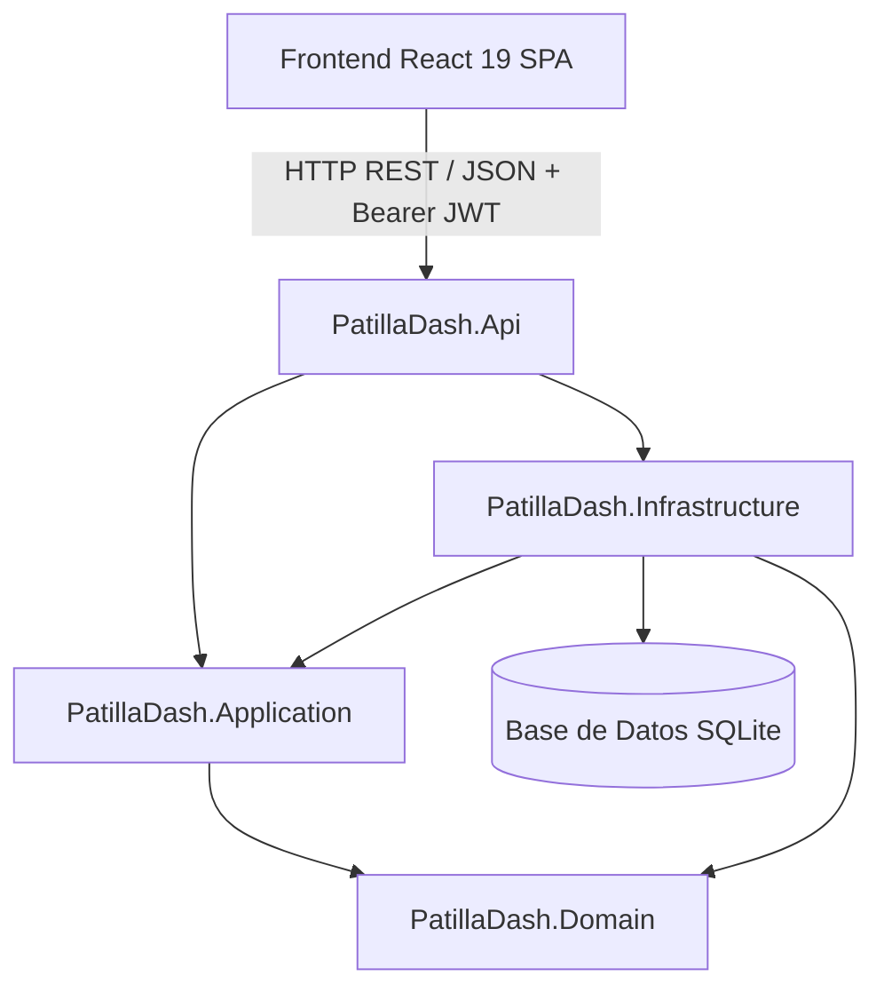

# 🍉 PatillaDash — Plataforma de Gestión Multi-Local de Bebidas Artesanales

Bienvenido al repositorio central de **PatillaDash**, una solución web full-stack moderna y desacoplada para la administración, ventas, abastecimiento e inventario de puntos de venta de jugos y bebidas artesanales de patilla (*"patillazos"*), refrescos y granizados.

---

## 📑 Tabla de Contenidos
1. [Visión y Modelo de Negocio](#-visión-y-modelo-de-negocio)
2. [Stack Tecnológico](#-stack-tecnológico)
3. [Arquitectura del Sistema](#-arquitectura-del-sistema)
4. [Credenciales por Defecto (Seed Automático)](#-credenciales-por-defecto-seed-automático)
5. [Guía de Inicio Rápido (Paso a Paso)](#-guía-de-inicio-rápido)
   - [Paso 1: Iniciar el Backend (.NET 10 API)](#paso-1-iniciar-el-backend-net-10-api)
   - [Paso 2: Iniciar el Frontend (React 19 + Vite)](#paso-2-iniciar-el-frontend-react-19--vite)
6. [Módulos y Vistas de la Aplicación](#-módulos-y-vistas-de-la-aplicación)
   - [Panel del Vendedor (Mobile-First)](#1-panel-del-vendedor-mobile-first)
   - [Panel del Administrador](#2-panel-del-administrador)
7. [Contratos de API y Endpoints](#-contratos-de-api-y-endpoints)
8. [Documentación Interactiva (Scalar OpenAPI)](#-documentación-interactiva-scalar-openapi)
9. [Pruebas Automatizadas (Testing)](#-pruebas-automatizadas)
10. [Estructura del Repositorio](#-estructura-del-repositorio)

---

## 🍉 Visión y Modelo de Negocio

El negocio de bebidas artesanales opera bajo el principio de **"Registro de Operación Diaria por Declaración"**:
* **Naturaleza de la materia prima:** Debido a la variabilidad natural del tamaño y rendimiento de las patillas/frutas, el inventario **no** se descuenta con recetas teóricas automáticas por vaso servido.
* **Cierre de Turno del Vendedor:** Al finalizar la jornada, el colaborador declara los totales recibidos en caja (**Efectivo** vs. **Transferencias / Nequi / Daviplata**), los productos vendidos y la **cantidad exacta de insumos consumidos** (ej. 4 patillas, 45 vasos 16oz, 2 kg de azúcar). Al enviar el formulario, el backend descuenta en tiempo real los insumos del stock de la sede.
* **Consolidación del Administrador:** El Administrador supervisa el inventario de todas las sedes con alertas de stock crítico, ingresa compras de materia prima (que suman inventario automáticamente), gestiona nómina/pagos y analiza métricas de rentabilidad.

### Matriz de Roles y Permisos

| Rol | Alcance | Vistas y Permisos Habilitados |
| :--- | :--- | :--- |
| **Vendedor** | Solo su local asignado (`LocalId`) | • Formulario de Cierre de Turno (Efectivo, Transferencias, Productos e Insumos consumidos).<br>• Monitoreo de stock de su sede.<br>• Historial de turnos recientes. |
| **Administrador** | Global (Todas las sedes) | • **Dashboard:** Balance Neto, Ingresos, Gastos (Compras + Nómina) y Ranking de Sedes.<br>• **Ventas y Cierres:** Historial completo con modal de auditoría de detalle.<br>• **Inventario:** Stock en tiempo real, alertas de stock crítico y ajuste manual.<br>• **Compras:** Registro de facturas con suma automática de inventario.<br>• **Personal y Nómina:** Registro de nuevos colaboradores y comprobantes de pago. |

---

## 🛠️ Stack Tecnológico

### Backend
* **Runtime:** .NET 10.0 (C# 13)
* **Framework:** ASP.NET Core Web API
* **Arquitectura:** Clean Architecture (Domain-Driven Design)
* **ORM:** Entity Framework Core 10 (SQLite con migraciones y seeder automático)
* **Seguridad:** JWT Bearer Authentication + Hasheo de contraseñas con `BCrypt.Net-Next`
* **Validación:** FluentValidation + Filtro global de validación
* **Manejo de Errores:** RFC 7807 `ProblemDetails` / `ValidationProblemDetails`
* **Documentación:** OpenAPI con `Scalar API Reference`
* **Testing:** xUnit, Moq, FluentAssertions (22 pruebas unitarias y de integración)

### Frontend
* **Entorno & Build Tool:** Node.js + Vite 8
* **Librería UI:** React 19 SPA
* **Enrutamiento:** React Router DOM v7 con `ProtectedRoute` y Guards por Rol
* **Estilos:** Tailwind CSS v4 con paleta temática personalizada (`patilla-*`)
* **Iconografía:** Lucide React
* **Cliente HTTP:** Axios con interceptores para inyección de JWT y captura de 401

---

## 🏛️ Arquitectura del Sistema



* **`PatillaDash.Domain`:** Entidades ricas (`Usuario`, `Local`, `Suministro`, `Producto`, `RegistroVentaDiaria`, `Compra`, `PagoEmpleado`), enums e interfaces de repositorios. Sin dependencias externas.
* **`PatillaDash.Application`:** Casos de uso, DTOs, servicios de aplicación y validadores `FluentValidation`.
* **`PatillaDash.Infrastructure`:** Persistencia EF Core, migraciones, DbInitializer (seed automático), repositorios, JWT Token Generator y Password Hasher.
* **`PatillaDash.Api`:** Controladores RESTful, filtros, middlewares RFC 7807, CORS y documentación Scalar.
* **`src/Frontend`:** Single Page Application (SPA) responsiva construida con componentes modulares y diseño limpio.

---

## 🔑 Credenciales por Defecto (Seed Automático)

Al iniciar el Backend por primera vez, el sistema crea automáticamente las tablas en SQLite y precarga los usuarios, sedes, productos e insumos de prueba:

| Rol | Correo Electrónico | Contraseña | Sede Asignada |
| :--- | :--- | :--- | :--- |
| **Administrador** | `admin@patilladash.com` | `Admin123!` | Global (Acceso a todas las sedes) |
| **Vendedor** | `carlos@patilladash.com` | `Vendedor123!` | Sede Centro (Local #1) |

---

## 🚀 Guía de Inicio Rápido

### Requisitos Previos
* [.NET 10 SDK](https://dotnet.microsoft.com/download) instalado (`dotnet --version`).
* [Node.js](https://nodejs.org/) v20+ y `npm` instalados (`node -v`, `npm -v`).

---

### Paso 1: Iniciar el Backend (.NET 10 API)

Abre una terminal y ejecuta:

```bash
cd src/Backend/PatillaDash.Api
dotnet run
```

> **La API se ejecutará en:** `http://localhost:5136`  
> **Documentación interactiva (Scalar):** [`http://localhost:5136/scalar/v1`](http://localhost:5136/scalar/v1)

---

### Paso 2: Iniciar el Frontend (React 19 + Vite)

Abre una **segunda terminal** y ejecuta:

```bash
cd src/Frontend
npm install
npm run dev
```

> **La aplicación cliente estará lista en:** [`http://localhost:5173`](http://localhost:5173)

---

## 🖥️ Módulos y Vistas de la Aplicación

### 1. Panel del Vendedor (`/vendedor`)
Diseñado con enfoque mobile-first para facilitar la agilidad al cierre de turno:
* **Totales en Caja:** Captura de dinero en efectivo y transferencias electrónicas (Nequi / Daviplata).
* **Desglose de Productos:** Registro de cantidades vendidas de vasos 16oz, 24oz, jarras familiares y refrescos con cálculo de subtotal en vivo.
* **Insumos Gastados:** Declaración de patillas, vasos, azúcar y bolsas de hielo utilizadas durante la jornada (se descuentan del stock al enviar).
* **Novedades:** Campo de observaciones para incidencias o averías.
* **Historial Reciente:** Lista de los últimos cierres de la sede con montos y fechas.

### 2. Panel del Administrador
* **Dashboard (`/admin`):**
  * KPIs clave: Ingresos Totales, Gastos Totales (Compras + Nómina) y Balance Neto.
  * Ranking de ventas consolidado por local.
  * Participación porcentual de Efectivo vs. Transferencias y método predominante.
* **Ventas y Cierres (`/admin/ventas`):**
  * Historial consolidado de ventas de todas las sedes con filtro por local.
  * **Modal de Detalle Completo:** Inspección profunda de cada venta con los productos comercializados, insumos descontados del inventario y notas del vendedor.
* **Inventario General (`/admin/inventario`):**
  * Monitoreo de stock por sede con buscador de insumos.
  * Badges de alerta en tiempo real (`Stock Crítico` vs `Óptimo`).
  * Modal para **Ajuste Manual de Stock**.
* **Compras y Entradas (`/admin/compras`):**
  * Formulario de compra de materia prima con **incremento automático de stock**.
  * Historial de facturas y gastos en compras por sede.
* **Personal y Pagos (`/admin/pagos`):**
  * Modal para registrar nuevos vendedores con asignación de sede.
  * Modal para registrar pagos de sueldos o anticipos con guardado en historial de nómina.

---

## 📡 Contratos de API y Endpoints

Todos los endpoints (salvo `/api/auth/login`) requieren header `Authorization: Bearer <TOKEN_JWT>`.

### 1. Autenticación (`/api/auth`)
* `POST /api/auth/login`: Autentica usuario y devuelve JWT con claims de rol y local.
* `POST /api/auth/register`: Registra un nuevo colaborador (Admin o Vendedor).

### 2. Ventas Diarias (`/api/ventas`)
* `POST /api/ventas/diaria`: Registra el cierre diario de caja y descuenta insumos.
* `GET /api/ventas`: Retorna el historial de ventas (opcionalmente filtrado por `?localId=...`) *(Solo Administrador)*.
* `GET /api/ventas/{id}`: Retorna el detalle completo de una venta específica con productos e insumos.
* `GET /api/ventas/local/{localId}`: Retorna las ventas del último mes de una sede.

### 3. Inventario (`/api/inventario`)
* `GET /api/inventario/local/{localId}`: Consulta el stock de suministros y alertas de un local.
* `PUT /api/inventario/stock`: Actualiza manualmente las existencias de un insumo *(Solo Administrador)*.

### 4. Compras (`/api/compras`)
* `POST /api/compras`: Registra compra de insumos e incrementa el stock disponible *(Solo Administrador)*.
* `GET /api/compras?localId=...`: Historial de facturas de compras *(Solo Administrador)*.

### 5. Pagos y Nómina (`/api/pagos`)
* `POST /api/pagos`: Registra un pago de nómina o anticipo a un empleado *(Solo Administrador)*.
* `GET /api/pagos/local/{localId}`: Historial de pagos realizados en un local *(Solo Administrador)*.
* `GET /api/pagos/vendedor/{vendedorId}`: Historial de pagos de un colaborador.

### 6. Estadísticas (`/api/estadisticas`)
* `GET /api/estadisticas/dashboard?fechaInicio=...&fechaFin=...`: Métricas consolidadas del negocio *(Solo Administrador)*.

---

## 📖 Documentación Interactiva (Scalar OpenAPI)

Para consultar y probar los endpoints interactivamente desde el navegador:
1. Inicia la API con `dotnet run`.
2. Visita: **[`http://localhost:5136/scalar/v1`](http://localhost:5136/scalar/v1)**

---

## 🧪 Pruebas Automatizadas

El backend incluye una suite de **22 pruebas unitarias y de integración** que validan entidades, lógica de dominio, servicios de aplicación, hashing, tokens JWT y controladores REST:

```bash
# Ejecutar todas las pruebas
dotnet test

# Ejecutar con detalles
dotnet test --logger "console;verbosity=normal"
```

Para verificar la compilación y empaquetado del frontend:
```bash
cd src/Frontend
npm run build
```

---

## 📂 Estructura del Repositorio

```text
PatillaDash/
├── README.md                                 # Documentación central del proyecto
├── PATILLADASH_SPEC.md                       # Especificación técnica del negocio
├── PatillaDash.slnx                          # Solución .NET 10
│
├── src/
│   ├── Backend/
│   │   ├── PatillaDash.Domain/               # Capa 1: Entidades, Enums e Interfaces
│   │   ├── PatillaDash.Application/          # Capa 2: Casos de uso, DTOs y FluentValidation
│   │   ├── PatillaDash.Infrastructure/       # Capa 3: EF Core SQLite, DbInitializer, Auth
│   │   └── PatillaDash.Api/                  # Capa 4: Controllers REST, Scalar, Middlewares
│   │
│   └── Frontend/                             # React 19 + Vite 8 + Tailwind CSS v4 SPA
│       ├── index.html
│       ├── vite.config.js
│       ├── package.json
│       └── src/
│           ├── components/                   # AdminLayout, ProtectedRoute, etc.
│           ├── context/                      # AuthContext
│           ├── pages/                        # Login, VendedorDashboard, AdminDashboard,
│           │                                 # AdminVentas, AdminInventario, AdminCompras, AdminPagos
│           └── services/                     # api.js con clientes HTTP Axios
│
└── tests/
    └── Backend/
        └── PatillaDash.Tests/                # Tests xUnit (Domain, Application, Infra, Api)
```
