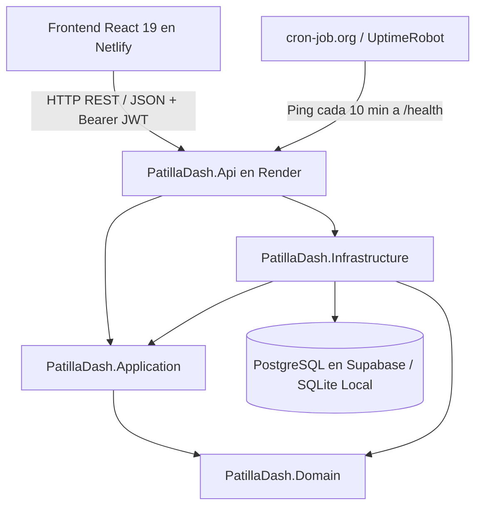

# 🍉 PatillaDash — Plataforma de Gestión Multi-Local de Bebidas Artesanales

Bienvenido al repositorio central de **PatillaDash**, una solución web full-stack moderna, reactiva y desacoplada para la administración, ventas, abastecimiento, business intelligence e inventario de puntos de venta de bebidas artesanales de patilla (*"patillazos"*), refrescos y fritos.

---

## 📑 Tabla de Contenidos
1. [Visión y Modelo de Negocio](#-visión-y-modelo-de-negocio)
2. [Stack Tecnológico](#-stack-tecnológico)
3. [Arquitectura del Sistema](#-arquitectura-del-sistema)
4. [Credenciales Sembradas (Datos Reales)](#-credenciales-sembradas-datos-reales)
5. [Guía de Inicio Rápido](#-guía-de-inicio-rápido)
   - [Paso 1: Iniciar el Backend (.NET 10 API)](#paso-1-iniciar-el-backend-net-10-api)
   - [Paso 2: Iniciar el Frontend (React 19 + Vite)](#paso-2-iniciar-el-frontend-react-19--vite)
   - [Prueba en Teléfonos Móviles (Red Wi-Fi Local)](#-prueba-en-teléfonos-móviles-red-wi-fi-local)
6. [Módulos y Experiencia de Usuario (UX/UI)](#-módulos-y-experiencia-de-usuario-uxui)
   - [Panel del Vendedor (Wizard Móvil en 3 Pasos)](#1-panel-del-vendedor-wizard-móvil-en-3-pasos)
   - [Panel del Administrador](#2-panel-del-administrador)
   - [Módulo de Business Intelligence (BI) y Analítica](#3-módulo-de-business-intelligence-bi-y-analítica)
   - [Flujo Directo de Reabastecimiento Crítico](#4-flujo-directo-de-reabastecimiento-crítico)
   - [Experiencia Móvil Optimizada y Error Boundary](#5-experiencia-móvil-optimizada-y-error-boundary)
7. [Seguridad y Anti-Inyecciones SQL](#-seguridad-y-anti-inyecciones-sql)
8. [Despliegue en la Nube y Costos Operativos ($0 USD)](#-despliegue-en-la-nube-y-costos-operativos-0-usd)
   - [Backend en Render](#backend-en-render-web-service)
   - [Frontend en Netlify](#frontend-en-netlify-spa)
   - [Base de Datos PostgreSQL (Supabase)](#base-de-datos-postgresql-supabase)
   - [Estrategia Keep-Alive 24/7 (Anti Cold-Start Gratuita)](#estrategia-keep-alive-247-anti-cold-start-gratuita)
   - [Portabilidad y Migración Futura de Base de Datos](#portabilidad-y-migración-futura-de-base-de-datos)
9. [Contratos de API y Endpoints](#-contratos-de-api-y-endpoints)
10. [Documentación Interactiva (Scalar OpenAPI)](#-documentación-interactiva-scalar-openapi)
11. [Pruebas Automatizadas (Testing)](#-pruebas-automatizadas)
12. [Estructura del Repositorio](#-estructura-del-repositorio)

---

## 🍉 Visión y Modelo de Negocio

El negocio de bebidas artesanales opera bajo el principio de **"Registro de Operación Diaria por Declaración"**:
* **Naturaleza de la materia prima:** Debido a la variabilidad natural del tamaño y rendimiento de las frutas, el inventario **no** se descuenta con recetas teóricas automáticas por vaso servido.
* **Cierre de Turno del Vendedor:** Al finalizar la jornada, el colaborador declara los totales recibidos en caja (**Efectivo** vs. **Transferencias / Nequi / Daviplata**), los productos vendidos y la **cantidad exacta de insumos consumidos** (ej. 4 patillas, 45 vasos 9oz, 2 kg de azúcar, bolsas de basura). Al enviar el formulario, el backend descuenta en tiempo real los insumos del stock de la sede.
* **Consolidación del Administrador:** El Administrador supervisa el inventario de todas las sedes con alertas de stock crítico separadas por local, ingresa compras de materia prima (que suman inventario automáticamente), gestiona nómina/pagos con validación de sede, audita cierres comparando dinero reportado vs. productos vendidos y consulta métricas avanzadas de Business Intelligence.

### Matriz de Roles y Permisos

| Rol | Alcance | Vistas y Permisos Habilitados |
| :--- | :--- | :--- |
| **Vendedor** | Solo su local asignado (`LocalId`) | • **Formulario Asistido (Wizard 3 Pasos):** Efectivo, Transferencias, Productos Vendidos e Insumos consumidos del catálogo de la sede.<br>• **Mi Historial de Turnos:** Pestaña independiente paginada a 10 registros por página.<br>• **Toasts Flotantes:** Notificaciones fijas en la parte superior sin necesidad de scroll.<br>• **Mobile Friendly:** Prevención de auto-zoom en iOS Safari y teclado adaptativo. |
| **Administrador** | Global (Todas las sedes) | • **Dashboard & BI:** Balance Neto, Ingresos, Gastos (Compras + Nómina), Alertas de Stock Crítico por Sede y **Modal Interactivo de Business Intelligence (BI)**.<br>• **Ventas y Cierres:** Historial general paginado (10 items) con **Auditoría de Cuadre** (Caja vs. Productos vendidos) y fechas estandarizadas.<br>• **Gestión de Productos:** Catálogo dinámico con activación/desactivación de ítems.<br>• **Inventario:** Stock en tiempo real, alertas y ajuste manual.<br>• **Compras y Reabastecimiento:** Panel prioritario de insumos críticos con compras a 1-clic y suma automática a inventario.<br>• **Personal y Nómina:** Registro de colaboradores y pagos con asignación estricta de sede. |

---

## 🛠️ Stack Tecnológico

### Backend
* **Runtime:** .NET 10.0 (C# 13)
* **Framework:** ASP.NET Core Web API
* **Arquitectura:** Clean Architecture (Domain-Driven Design)
* **ORM:** Entity Framework Core 10 (Soporte multi-proveedor SQLite para desarrollo local y PostgreSQL para producción en la nube)
* **Seguridad:** JWT Bearer Authentication + Hasheo de contraseñas con `BCrypt.Net-Next` + Consultas 100% parametrizadas anti-inyección SQL
* **Validación:** FluentValidation + Filtro global de validación
* **Manejo de Errores:** RFC 7807 `ProblemDetails` / `ValidationProblemDetails`
* **Documentación:** OpenAPI con `Scalar API Reference`
* **Testing:** xUnit, Moq, FluentAssertions (22 pruebas unitarias y de integración)

### Frontend
* **Entorno & Build Tool:** Node.js + Vite 8
* **Librería UI:** React 19 SPA
* **Enrutamiento:** React Router DOM v7 con `ProtectedRoute`, sincronización inmediata de sesión y Guards por Rol
* **Estilos:** Tailwind CSS v4 con paleta temática personalizada (`patilla-*`)
* **Iconografía:** Lucide React
* **Cliente HTTP:** Axios con interceptores para inyección de JWT y captura global de 401
* **UX Móvil & Resiliencia:** `ErrorBoundary` global, prevención de auto-zoom en inputs de iOS (16px base), `overscroll-contain`, aceleración por GPU (`transform-gpu`) y bloqueo de scroll de fondo en modales.

---

## 🏛️ Arquitectura del Sistema



---

## 🔑 Credenciales Sembradas (Datos Reales)

El backend inicializa automáticamente la base de datos y coloca los usuarios, puntos de venta y productos listos para operar:

| Rol | Nombre | Correo Electrónico | Contraseña | Sede Asignada |
| :--- | :--- | :--- | :--- | :--- |
| **Administrador** | Administrador Principal | `admin@patilladash.com` | `Admin123!` | Global (Acceso a todas las sedes) |
| **Vendedor** | Maricela Montenegro | `maricela@patilladash.com` | `Vendedor123!` | Punto de la 30 (Local #1) |
| **Vendedor** | Yenirbeth Yadelin | `yenirbeth@patilladash.com` | `Vendedor123!` | Punto de la 27 (Local #2) |

### Catálogo de Productos Inicial
* **Galletas el pedazo:** $1.000 COP
* **Vaso 7oz:** $2.000 COP
* **Vaso 9oz:** $3.000 COP
* **Vaso 14oz:** $5.000 COP
* **Deditos:** $2.500 COP
* **Pastelitos:** $3.000 COP

---

## 🚀 Guía de Inicio Rápido

### Requisitos Previos
* [.NET 10 SDK](https://dotnet.microsoft.com/download) instalado (`dotnet --version`).
* [Node.js](https://nodejs.org/) v20+ y `npm` instalados (`node -v`, `npm -v`).

---

### Paso 1: Iniciar el Backend (.NET 10 API)

Abre una terminal y ejecuta:

```bash
cd src/Backend/PatillaDash.Api
dotnet run
```

> **La API se ejecutará en:** `http://localhost:5136` (y `http://0.0.0.0:5136` para red local)  
> **Documentación interactiva (Scalar):** [`http://localhost:5136/scalar/v1`](http://localhost:5136/scalar/v1)

---

### Paso 2: Iniciar el Frontend (React 19 + Vite)

Abre una **segunda terminal** y ejecuta:

```bash
cd src/Frontend
npm install
npm run dev
```

> **La aplicación cliente estará lista en:** [`http://localhost:5173`](http://localhost:5173)

---

### 📱 Prueba en Teléfonos Móviles (Red Wi-Fi Local)

Para probar la plataforma desde diferentes smartphones conectados a la misma red Wi-Fi:
1. Obtén tu IP local (`ip addr show` o `ifconfig`).
2. Abre el navegador en el teléfono e ingresa a:
   ```text
   http://<TU_IP_LOCAL>:5173
   ```
   *(Ejemplo: `http://192.168.1.15:5173`)*

---

## 🖥️ Módulos y Experiencia de Usuario (UX/UI)

### 1. Panel del Vendedor (Wizard Móvil en 3 Pasos)
Diseñado específicamente para smartphones y agilidad en el puesto de trabajo:
* **Paso 1 (Dinero en Caja):** Ingreso de Efectivo físico y Transferencias (Nequi / Daviplata) con totalizador en vivo.
* **Paso 2 (Productos Vendidos):** Catálogo de vasos 7oz, 9oz, 14oz, fritos (deditos/pastelitos) y galletas con botones táctiles `+` / `-`.
* **Paso 3 (Insumos Gastados & Finalizar):** Formulario dinámico con todos los insumos de la sede (Patillas, Vasos, Azúcar, Cucharas, etc.) y novedades del turno.
* **Pestaña "Mi Historial":** Vista separada con paginación de 10 turnos por página y formato de fechas unificado (`es-CO`).

---

### 2. Panel del Administrador
* **Dashboard (`/admin`):**
  * Balance Neto, Ingresos Totales, Gastos (Compras + Nómina) y Métodos de Pago.
  * **Alertas de Stock Crítico agrupadas por Sede:** Visualiza rápidamente qué insumos faltan en cada local con botón directo `Surtir este insumo`.
  * Ranking consolidado de ventas por local.
* **Ventas y Cierres (`/admin/ventas`):**
  * Historial general con filtro por sede y paginación de 10 registros.
  * **Auditoría de Cierre:** Comparativa automática entre el *Dinero Reportado en Caja* vs. *Total según Productos Vendidos* indicando **Cuadre Perfecto ($0)**, **Sobrante** o **Descuadre**.
* **Gestión de Productos (`/admin/productos`):**
  * Creación, edición de precios y activación/desactivación de ítems del catálogo.
* **Inventario General (`/admin/inventario`):**
  * Existencias en tiempo real, alertas de stock mínimo y modal de ajuste manual.
* **Compras y Entradas (`/admin/compras`):**
  * Panel superior de reabastecimiento urgente de insumos en alerta y registro con auto-incremento de stock.
* **Personal y Nómina (`/admin/pagos`):**
  * Registro de colaboradores y pagos de nómina con selección estricta de sede.

---

### 3. Módulo de Business Intelligence (BI) y Analítica
Al hacer clic en la tarjeta **Ingresos Totales (BI)** del Dashboard:
* **Filtros Dinámicos:** Segmentación por Sede (*Todas*, *Punto de la 30*, *Punto de la 27*) y Periodo (*Histórico*, *Últimos 30 días*, *Últimos 7 días*).
* **Métricas Clave:** Ingresos filtrados, Ticket Promedio por Turno, Total de Unidades Vendidas y Turnos Auditados.
* **Gráficas Integradas:** Participación de ventas por sede, productos más vendidos y distribución de medios de pago (Efectivo vs. Transferencia).

---

### 4. Flujo Directo de Reabastecimiento Crítico
* Desde las alertas de stock crítico en el Dashboard, cada insumo incluye el acceso directo `Surtir este insumo`.
* Al hacer clic, navega automáticamente a la vista de compras (`/admin/compras`), pre-seleccionando la sede, el insumo correspondiente y abriendo el modal de registro al instante.

---

### 5. Experiencia Móvil Optimizada y Error Boundary
* **Error Boundary Global:** Captura cualquier anomalía visual imprevista en componentes de React, mostrando una pantalla amigable de recuperación y evitando páginas en blanco.
* **Prevención de Auto-Zoom en iOS:** Tamaños de fuente mínimos de `16px` (`text-base sm:text-sm`) en campos de texto para evitar que Safari amplíe bruscamente la pantalla.
* **Autocorrección Desactivada en Credenciales:** `autoCapitalize="none"`, `autoCorrect="off"` y `spellCheck="false"` en correo electrónico para evitar que teclados móviles agreguen mayúsculas automáticas.
* **Bloqueo de Scroll de Fondo (*Body Scroll Lock*):** Al abrir cualquier modal o menú lateral, el fondo de la pantalla queda congelado, impidiendo movimientos erráticos en smartphones.

---

## 🔒 Seguridad y Anti-Inyecciones SQL

* **Cero SQL Concatenado:** Todas las operaciones a la base de datos se ejecutan mediante consultas fuertemente tipadas y parametrizadas con **Entity Framework Core LINQ**, eliminando cualquier vector de SQL Injection.
* **Contraseñas Criptográficamente Seguras:** Hasheadas con algoritmo **BCrypt** de factor de costo adaptativo.
* **Protección de Rutas y JWT:** Validación de firmas criptográficas Bearer JWT en backend y Guards reactivos en frontend.

---

## ☁️ Despliegue en la Nube y Costos Operativos ($0 USD)

Toda la infraestructura productiva actual opera bajo planes gratuitos perpetuos:

| Componente | Plataforma Elegida | Límite Gratuito Incluido | Costo Mensual |
| :--- | :--- | :--- | :--- |
| **Backend API** | [Render](https://render.com) (Web Service Linux) | 750 horas de cómputo / mes (suficiente para 24/7) | **$0.00** |
| **Frontend SPA** | [Netlify](https://netlify.com) (CDN Edge) | 100 GB ancho de banda + 300 min build | **$0.00** |
| **Base de Datos** | [Supabase](https://supabase.com) (PostgreSQL 15+) | 500 MB almacenamiento + backups automáticos | **$0.00** |
| **Keep-Alive Monitor** | [cron-job.org](https://cron-job.org) | Tareas recurrentes ilimitadas y pings HTTP | **$0.00** |

### Backend en Render (Web Service)
* **Entorno:** .NET 10 Web Service en Linux.
* **URL Pública:** `https://patilladash-api.onrender.com`
* **Variables de Entorno en Render:**
  * `DATABASE_URL`: Cadena de conexión a PostgreSQL (`postgres://postgres:[PASSWORD]@[HOST]:[PORT]/postgres`).
  * `JWT_SECRET_KEY`: Llave secreta para generación y validación de tokens JWT.
  * `PORT`: Determinado dinámicamente por Render (ej. `10000`).

### Frontend en Netlify (SPA)
* **Repositorio:** Conectado a GitHub vía CI/CD (despliegues automáticos con cada `git push`).
* **Base directory:** `src/Frontend`
* **Build command:** `npm run build`
* **Publish directory:** `dist`
* **Variables de Entorno en Netlify:**
  * `VITE_API_URL`: `https://patilladash-api.onrender.com/api`

### Base de Datos PostgreSQL (Supabase)
* Configurada con auto-incrementos nativos vía `GENERATED BY DEFAULT AS IDENTITY`, compatibilidad de tipos `boolean` y soporte de timestamps universales.

### Estrategia Keep-Alive 24/7 (Anti Cold-Start Gratuita)
En las nubes gratuitas, los servidores entran en suspensión tras 15 minutos de inactividad, lo que causa una demora de arranque de 30-50 segundos al siguiente usuario. Para garantizar respuesta en <200 ms a las vendedoras:
* Se configuró un cronjob en **cron-job.org** que envía un `GET` cada 10 minutos a `https://patilladash-api.onrender.com/health`.
* El endpoint responde en 1 milisegundo directamente desde memoria (`{ "status": "Healthy" }`), manteniendo el contenedor caliente sin consumir transferencias ni recursos de base de datos.
* También admite solicitudes `HEAD` para monitores externos como **UptimeRobot**.

### Portabilidad y Migración Futura de Base de Datos
El proyecto fue construido bajo Clean Architecture con **cero dependencia propietaria de Supabase**:
* **100% Estándar PostgreSQL:** No se usan extensiones exclusivas ni bloqueos de proveedor.
* Si en el futuro se desea mudar a **Neon**, **Railway**, **Amazon Aurora / RDS**, **DigitalOcean** o un servidor propio:
  1. Exportar datos actuales:
     ```bash
     pg_dump -h <HOST_SUPABASE> -U postgres -d postgres > backup_patilladash.sql
     ```
  2. Importar en el nuevo proveedor:
     ```bash
     psql -h <NUEVO_HOST> -U <NUEVO_USUARIO> -d <NUEVA_BD> < backup_patilladash.sql
     ```
  3. Actualizar la variable de entorno `DATABASE_URL` en el dashboard de Render.
  4. **Cero cambios de código requeridos en la aplicación.**

---

## 📡 Contratos de API y Endpoints

Todos los endpoints (salvo `/api/auth/login`) requieren header `Authorization: Bearer <TOKEN_JWT>`.

### 1. Autenticación y Usuarios (`/api/auth`)
* `POST /api/auth/login`: Autentica credenciales y devuelve JWT con claims de rol y local.
* `POST /api/auth/register`: Registra un nuevo colaborador.
* `GET /api/auth/usuarios?localId=...`: Consulta el listado de colaboradores *(Solo Administrador)*.

### 2. Ventas Diarias (`/api/ventas`)
* `POST /api/ventas/diaria`: Registra el cierre diario de caja, productos e insumos consumidos.
* `GET /api/ventas?localId=...`: Historial general de ventas *(Solo Administrador)*.
* `GET /api/ventas/{id}`: Detalle de auditoría con productos, consumos y totales.
* `GET /api/ventas/local/{localId}`: Ventas recientes de una sede específica.

### 3. Inventario (`/api/inventario`)
* `GET /api/inventario/local/{localId}`: Consulta existencias y alertas de suministros de un local.
* `PUT /api/inventario/stock`: Ajuste manual de stock *(Solo Administrador)*.

### 4. Productos (`/api/productos`)
* `GET /api/productos?incluirInactivos=...`: Listado de catálogo de productos.
* `POST /api/productos`: Crear nuevo producto *(Solo Administrador)*.
* `PUT /api/productos/{id}`: Actualizar producto *(Solo Administrador)*.
* `DELETE /api/productos/{id}`: Desactivar producto *(Solo Administrador)*.

### 5. Compras (`/api/compras`)
* `POST /api/compras`: Registra compra de insumos y suma stock disponible *(Solo Administrador)*.
* `GET /api/compras?localId=...`: Historial de compras *(Solo Administrador)*.

### 6. Pagos y Nómina (`/api/pagos`)
* `POST /api/pagos`: Registra pago de nómina validando la sede del colaborador *(Solo Administrador)*.
* `GET /api/pagos/local/{localId}`: Historial de pagos de una sede *(Solo Administrador)*.
* `GET /api/pagos/vendedor/{vendedorId}`: Historial de pagos de un colaborador.

### 7. Estadísticas (`/api/estadisticas`)
* `GET /api/estadisticas/dashboard?fechaInicio=...&fechaFin=...`: Métricas consolidadas, ranking y alertas de stock de todas las sedes *(Solo Administrador)*.

---

## 📖 Documentación Interactiva (Scalar OpenAPI)

Para consultar y ejecutar pruebas interactivas de la API:
1. Inicia la API con `dotnet run` (o accede a la URL en producción de Render).
2. Ingresa a: **[`https://patilladash-api.onrender.com/scalar/v1`](https://patilladash-api.onrender.com/scalar/v1)** *(o `http://localhost:5136/scalar/v1` en local)*.

---

## 🧪 Pruebas Automatizadas

El backend cuenta con una suite de **22 pruebas unitarias y de integración** (xUnit + Moq + FluentAssertions):

```bash
# Ejecutar todas las pruebas del Backend
dotnet test --no-restore

# Ejecutar con detalles
dotnet test --logger "console;verbosity=normal"
```

Para comprobar la compilación de producción del Frontend:
```bash
cd src/Frontend
npm run build
```

---

## 📁 Estructura del Repositorio

```text
PatillaDash/
├── README.md                                 # Documentación central del proyecto
├── PATILLADASH_SPEC.md                       # Especificación técnica del negocio
├── netlify.toml                              # Configuración central de despliegue Netlify
├── PatillaDash.slnx                          # Solución .NET 10
│
├── src/
│   ├── Backend/
│   │   ├── PatillaDash.Domain/               # Entidades, Enums e Interfaces
│   │   ├── PatillaDash.Application/          # Casos de uso, DTOs y FluentValidation
│   │   ├── PatillaDash.Infrastructure/       # EF Core (SQLite / Postgres), DbInitializer, Auth
│   │   └── PatillaDash.Api/                  # Controllers REST, Scalar, Middlewares
│   │
│   └── Frontend/                             # React 19 + Vite 8 + Tailwind CSS v4 SPA
│       ├── index.html
│       ├── vite.config.js
│       ├── package.json
│       └── src/
│           ├── components/                   # AdminLayout, ProtectedRoute, ErrorBoundary, etc.
│           ├── context/                      # AuthContext
│           ├── pages/                        # Login, VendedorDashboard, AdminDashboard,
│           │                                 # AdminVentas, AdminInventario, AdminCompras,
│           │                                 # AdminPagos, AdminProductos
│           └── services/                     # api.js con Axios y manejo seguro de errores
│
└── tests/
    └── Backend/
        └── PatillaDash.Tests/                # Tests xUnit (Domain, Application, Infra, Api)
```
