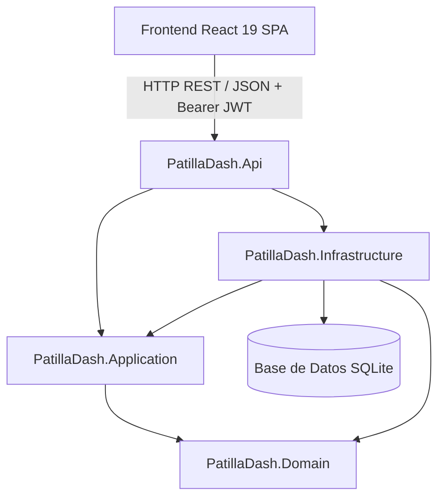

# 🍉 PatillaDash — Plataforma de Gestión Multi-Local de Bebidas Artesanales

Bienvenido al repositorio central de **PatillaDash**, una solución web full-stack moderna, reactiva y desacoplada para la administración, ventas, abastecimiento e inventario de puntos de venta de bebidas artesanales de patilla (*"patillazos"*), refrescos y granizados.

---

## 📑 Tabla de Contenidos
1. [Visión y Modelo de Negocio](#-visión-y-modelo-de-negocio)
2. [Stack Tecnológico](#-stack-tecnológico)
3. [Arquitectura del Sistema](#-arquitectura-del-sistema)
4. [Credenciales por Defecto (Seed Automático)](#-credenciales-por-defecto-seed-automático)
5. [Guía de Inicio Rápido](#-guía-de-inicio-rápido)
   - [Paso 1: Iniciar el Backend (.NET 10 API)](#paso-1-iniciar-el-backend-net-10-api)
   - [Paso 2: Iniciar el Frontend (React 19 + Vite)](#paso-2-iniciar-el-frontend-react-19--vite)
   - [Prueba en Teléfonos Móviles (Red Wi-Fi Local)](#-prueba-en-teléfonos-móviles-red-wi-fi-local)
6. [Módulos y Experiencia de Usuario (UX)](#-módulos-y-experiencia-de-usuario-ux)
   - [Panel del Vendedor (Wizard en 3 Pasos + Mobile-First)](#1-panel-del-vendedor-wizard-en-3-pasos--mobile-first)
   - [Panel del Administrador](#2-panel-del-administrador)
7. [Contratos de API y Endpoints](#-contratos-de-api-y-endpoints)
8. [Documentación Interactiva (Scalar OpenAPI)](#-documentación-interactiva-scalar-openapi)
9. [Pruebas Automatizadas (Testing)](#-pruebas-automatizadas)
10. [Estructura del Repositorio](#-estructura-del-repositorio)

---

## 🍉 Visión y Modelo de Negocio

El negocio de bebidas artesanales opera bajo el principio de **"Registro de Operación Diaria por Declaración"**:
* **Naturaleza de la materia prima:** Debido a la variabilidad natural del tamaño y rendimiento de las frutas, el inventario **no** se descuenta con recetas teóricas automáticas por vaso servido.
* **Cierre de Turno del Vendedor:** Al finalizar la jornada, el colaborador declara los totales recibidos en caja (**Efectivo** vs. **Transferencias / Nequi / Daviplata**), los productos vendidos y la **cantidad exacta de insumos consumidos** (ej. 4 patillas, 45 vasos 16oz, 2 kg de azúcar, 2 bolsas de hielo). Al enviar el formulario, el backend descuenta en tiempo real los insumos del stock de la sede.
* **Consolidación del Administrador:** El Administrador supervisa el inventario de todas las sedes con alertas de stock crítico separadas por local, ingresa compras de materia prima (que suman inventario automáticamente), gestiona nómina/pagos con validación de sede y audita cierres comparando dinero reportado vs. productos vendidos.

### Matriz de Roles y Permisos

| Rol | Alcance | Vistas y Permisos Habilitados |
| :--- | :--- | :--- |
| **Vendedor** | Solo su local asignado (`LocalId`) | • **Formulario Asistido (Wizard 3 Pasos):** Efectivo, Transferencias, Productos Vendidos e Insumos consumidos del catálogo de la sede.<br>• **Mi Historial de Turnos:** Pestaña independiente paginada a 10 registros por página.<br>• **Toasts Flotantes:** Notificaciones fijas en la parte superior sin necesidad de scroll. |
| **Administrador** | Global (Todas las sedes) | • **Dashboard:** Balance Neto, Ingresos, Gastos (Compras + Nómina), Ranking de Sedes y **Alertas de Stock Crítico divididas por Sede**.<br>• **Ventas y Cierres:** Historial completo con **Auditoría de Cuadre** (Caja vs. Productos vendidos).<br>• **Inventario:** Stock en tiempo real, alertas y ajuste manual.<br>• **Compras:** Registro de facturas con suma automática de inventario.<br>• **Personal y Nómina:** Registro de colaboradores con modales asistidos y pagos con asignación estricta de sede. |

---

## 🛠️ Stack Tecnológico

### Backend
* **Runtime:** .NET 10.0 (C# 13)
* **Framework:** ASP.NET Core Web API
* **Arquitectura:** Clean Architecture (Domain-Driven Design)
* **ORM:** Entity Framework Core 10 (SQLite con migraciones y seeder automático)
* **Seguridad:** JWT Bearer Authentication + Hasheo con `BCrypt.Net-Next`
* **Validación:** FluentValidation + Filtro global de validación
* **Manejo de Errores:** RFC 7807 `ProblemDetails` / `ValidationProblemDetails`
* **Documentación:** OpenAPI con `Scalar API Reference`
* **Testing:** xUnit, Moq, FluentAssertions (22 pruebas unitarias y de integración)

### Frontend
* **Entorno & Build Tool:** Node.js + Vite 8
* **Librería UI:** React 19 SPA
* **Enrutamiento:** React Router DOM v7 con `ProtectedRoute` y Guards por Rol
* **Estilos:** Tailwind CSS v4 con paleta temática personalizada (`patilla-*`)
* **Iconografía:** Lucide React
* **Cliente HTTP:** Axios con interceptores para inyección de JWT y captura global de 401

---

## 🏛️ Arquitectura del Sistema



---

## 🔑 Credenciales por Defecto (Seed Automático)

Al iniciar el Backend por primera vez, el sistema crea automáticamente la base de datos en SQLite y precarga las sedes, insumos, productos y usuarios de prueba:

| Rol | Correo Electrónico | Contraseña | Sede Asignada |
| :--- | :--- | :--- | :--- |
| **Administrador** | `admin@patilladash.com` | `Admin123!` | Global (Acceso a todas las sedes) |
| **Vendedor** | `carlos@patilladash.com` | `Vendedor123!` | Sede Centro (Local #1) |

---

## 🚀 Guía de Inicio Rápido

### Requisitos Previos
* [.NET 10 SDK](https://dotnet.microsoft.com/download) instalado (`dotnet --version`).
* [Node.js](https://nodejs.org/) v20+ y `npm` instalados (`node -v`, `npm -v`).

---

### Paso 1: Iniciar el Backend (.NET 10 API)

Abre una terminal y ejecuta:

```bash
cd src/Backend/PatillaDash.Api
dotnet run
```

> **La API se ejecutará en:** `http://localhost:5136` (y `http://0.0.0.0:5136` para red local)  
> **Documentación interactiva (Scalar):** [`http://localhost:5136/scalar/v1`](http://localhost:5136/scalar/v1)

---

### Paso 2: Iniciar el Frontend (React 19 + Vite)

Abre una **segunda terminal** y ejecuta:

```bash
cd src/Frontend
npm install
npm run dev
```

> **La aplicación cliente estará lista en:** [`http://localhost:5173`](http://localhost:5173)

---

### 📱 Prueba en Teléfonos Móviles (Red Wi-Fi Local)

Para probar la plataforma desde diferentes smartphones conectados a la misma red Wi-Fi:
1. Obtén tu IP local (`ip addr show` o `ifconfig`).
2. Abre el navegador en el teléfono e ingresa a:
   ```text
   http://<TU_IP_LOCAL>:5173
   ```
   *(Ejemplo: `http://10.14.19.223:5173`)*

---

## 🖥️ Módulos y Experiencia de Usuario (UX)

### 1. Panel del Vendedor (Wizard en 3 Pasos + Mobile-First)
Diseñado específicamente para smartphones y agilidad en el puesto de trabajo:
* **Paso 1 (Dinero en Caja):** Ingreso de Efectivo físico y Transferencias (Nequi / Daviplata) con totalizador en vivo.
* **Paso 2 (Productos Vendidos):** Catálogo de vasos 16oz, 24oz, jarras familiares y refrescos con botones táctiles `+` / `-` y subtotales.
* **Paso 3 (Insumos Gastados & Finalizar):** Formulario dinámico con todos los insumos de la sede (Patillas, Vasos, Azúcar, **Bolsas de Hielo 🧊**, etc.), visualización del stock actual y novedades del turno.
* **Pestaña "Mi Historial":** Vista separada con paginación de 10 turnos por página.
* **Alertas Toast Flotantes:** Notificaciones fijadas arriba (`fixed top-4`) visibles al instante sin hacer scroll.

### 2. Panel del Administrador
* **Dashboard (`/admin`):**
  * Balance Neto, Ingresos Totales, Gastos (Compras + Nómina) y Métodos de Pago.
  * **Alertas de Stock Crítico agrupadas por Sede:** Visualiza claramente qué insumos faltan en cada local con botón directo a compras.
  * Ranking consolidado de ventas por local.
* **Ventas y Cierres (`/admin/ventas`):**
  * Historial general con filtro por sede.
  * **Auditoría de Cierre:** Comparativa automática entre el *Dinero Reportado en Caja* vs. *Total según Productos Vendidos* indicando **Cuadre Perfecto ($0)**, **Sobrante** o **Descuadre**.
  * Desglose completo de insumos descontados y observaciones.
* **Inventario General (`/admin/inventario`):**
  * Existencias en tiempo real, alertas de stock mínimo y modal de ajuste manual.
* **Compras y Entradas (`/admin/compras`):**
  * Registro de compras con incremento automático de inventario.
* **Personal y Nómina (`/admin/pagos`):**
  * Registro de colaboradores con mensajes de error dentro del modal (`backdrop-blur`).
  * Registro de pagos con **selector por Nombre de Vendedor** y **validación estricta de sede** para evitar desfasar gastos a sedes incorrectas.

---

## 📡 Contratos de API y Endpoints

Todos los endpoints (salvo `/api/auth/login`) requieren header `Authorization: Bearer <TOKEN_JWT>`.

### 1. Autenticación y Usuarios (`/api/auth`)
* `POST /api/auth/login`: Autentica credenciales y devuelve JWT con claims de rol y local.
* `POST /api/auth/register`: Registra un nuevo colaborador.
* `GET /api/auth/usuarios?localId=...`: Consulta el listado de colaboradores con su nombre y sede asignada *(Solo Administrador)*.

### 2. Ventas Diarias (`/api/ventas`)
* `POST /api/ventas/diaria`: Registra el cierre diario de caja, productos e insumos consumidos.
* `GET /api/ventas?localId=...`: Historial general de ventas *(Solo Administrador)*.
* `GET /api/ventas/{id}`: Detalle de auditoría con productos, consumos y totales.
* `GET /api/ventas/local/{localId}`: Ventas recientes de una sede específica.

### 3. Inventario (`/api/inventario`)
* `GET /api/inventario/local/{localId}`: Consulta existencias y alertas de suministros de un local.
* `PUT /api/inventario/stock`: Ajuste manual de stock *(Solo Administrador)*.

### 4. Compras (`/api/compras`)
* `POST /api/compras`: Registra compra de insumos y suma stock disponible *(Solo Administrador)*.
* `GET /api/compras?localId=...`: Historial de facturas de compras *(Solo Administrador)*.

### 5. Pagos y Nómina (`/api/pagos`)
* `POST /api/pagos`: Registra pago de nómina validando la sede del colaborador *(Solo Administrador)*.
* `GET /api/pagos/local/{localId}`: Historial de pagos de una sede *(Solo Administrador)*.
* `GET /api/pagos/vendedor/{vendedorId}`: Historial de pagos de un colaborador.

### 6. Estadísticas (`/api/estadisticas`)
* `GET /api/estadisticas/dashboard?fechaInicio=...&fechaFin=...`: Métricas consolidadas, ranking y alertas de stock de todas las sedes *(Solo Administrador)*.

---

## 📖 Documentación Interactiva (Scalar OpenAPI)

Para consultar y ejecutar pruebas interactivas de la API:
1. Inicia la API con `dotnet run`.
2. Ingresa a: **[`http://localhost:5136/scalar/v1`](http://localhost:5136/scalar/v1)**

---

## 🧪 Pruebas Automatizadas

El backend cuenta con una suite de **22 pruebas unitarias y de integración** (xUnit + Moq + FluentAssertions):

```bash
# Ejecutar todas las pruebas del Backend
dotnet test

# Ejecutar con detalles
dotnet test --logger "console;verbosity=normal"
```

Para comprobar la compilación de producción del Frontend:
```bash
cd src/Frontend
npm run build
```

---

## 📁 Estructura del Repositorio

```text
PatillaDash/
├── README.md                                 # Documentación central del proyecto
├── PATILLADASH_SPEC.md                       # Especificación técnica del negocio
├── PatillaDash.slnx                          # Solución .NET 10
│
├── src/
│   ├── Backend/
│   │   ├── PatillaDash.Domain/               # Entidades, Enums e Interfaces
│   │   ├── PatillaDash.Application/          # Casos de uso, DTOs y FluentValidation
│   │   ├── PatillaDash.Infrastructure/       # EF Core SQLite, DbInitializer, Auth
│   │   └── PatillaDash.Api/                  # Controllers REST, Scalar, Middlewares
│   │
│   └── Frontend/                             # React 19 + Vite 8 + Tailwind CSS v4 SPA
│       ├── index.html
│       ├── vite.config.js
│       ├── package.json
│       └── src/
│           ├── components/                   # AdminLayout, ProtectedRoute, etc.
│           ├── context/                      # AuthContext
│           ├── pages/                        # Login, VendedorDashboard, AdminDashboard,
│           │                                 # AdminVentas, AdminInventario, AdminCompras, AdminPagos
│           └── services/                     # api.js con clientes HTTP Axios
│
└── tests/
    └── Backend/
        └── PatillaDash.Tests/                # Tests xUnit (Domain, Application, Infra, Api)
```
